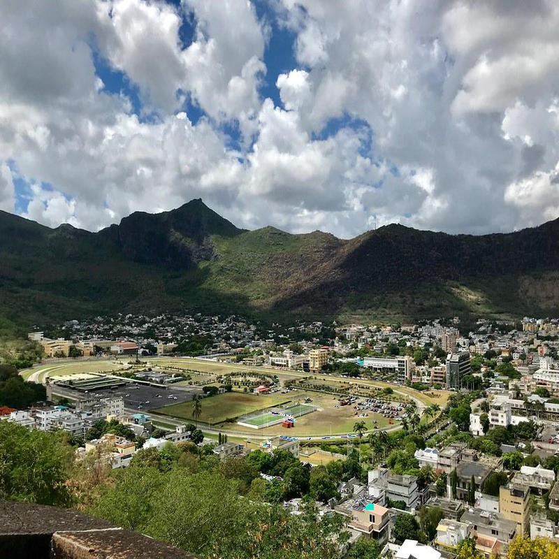

# Image-Anomaly-Detection-With-CNN

This repo contains the slides and Jupyter notebook from Anthony Wang and Yuefan Wang's final project in MSDS 631 Introduction to Deep Learning at University of San Francisco. 

## Objectives

Our motivation behind this project was to approach object detection from a different perspective. Oftentimes, object detection in deep learning is to train a model that can mimic a human being's object detection ability. The picture below is what a typical object detection model does.

For many object detection models, the model is considered good enough if it can do what a human does. What if we could train a model to detect nearly imperceptible changes in color and shading? We were curious to test how "sharp" an object detection model's vision could get.

It's easy to see what's going on here. We've changed the color in the middle of the lake to bright green, and it's not exactly camouflaged. Let's make the task harder.

You probably didn't notice where the anomaly is. If you did, it probably took you a while.

We took a random landscape photo and multiplied all the RGB values of the pixels inside this box by 1.2-- if you look carefully, you can see a few patches of neon. Let's find out if we train a model that can detect anomalies like this.

## Data Preparation

We wrote a [script](notebooks/image_scrambling.ipynb) that scraped around 300 photos and modified them all in subtle ways like in the photo above. To prepare this data, We created a folder with all the altered photos and a dataframe. Each row of the dataframe has a path to a specific photo as well as which part of the photo We altered and the ratio that increased the RGB values of the pixels. This is one example:

The dataset we prepared looks like this:

We were going to build models to leverage images and numeric features **r** and **discolor_ratio** to predict the coordinates of the center of the anomaly we created in the images, **x** and **y**.

## Model Trained

We trained 5 CNN-style models to predict **x** and **y**. Refer to this [notebook](notebooks/model_training.ipynb).

1. CNN trained with only images data with a higher learning rate and fewer epochs
2. CNN trained with only images data with a lower learning rate and more epochs
3. CNN trained with images and numeric features combined before the fully connected layers
4. CNN trained with images and numeric features combined before the last fully connected layers
5. CNN trained images and numeric features passing through a linear layer first then combined before the last fully connected layers

The loss function those models trained was Mean Squared Error and the evaluation matrix used was the average distance between the predicted coordinates and the true coordinates **x** and **y**.

We wanted to examine if different training techniques or different ways of combining numeric features with image data were helpful or not.

## Finding

We can observe from the picture above that:

1. Model 1 has the best performance in having the lowest average distance between the predicted coordinates and the true coordinates.
2. All models' validation matrix tends to fall into a similar range.
3. Some models are quicker to converge than others. 

Based on the limited approaches we tried, we can conclude that different training techniques and combining numeric features with image data to train a CNN-style model for our task did not help in a meaningful way.