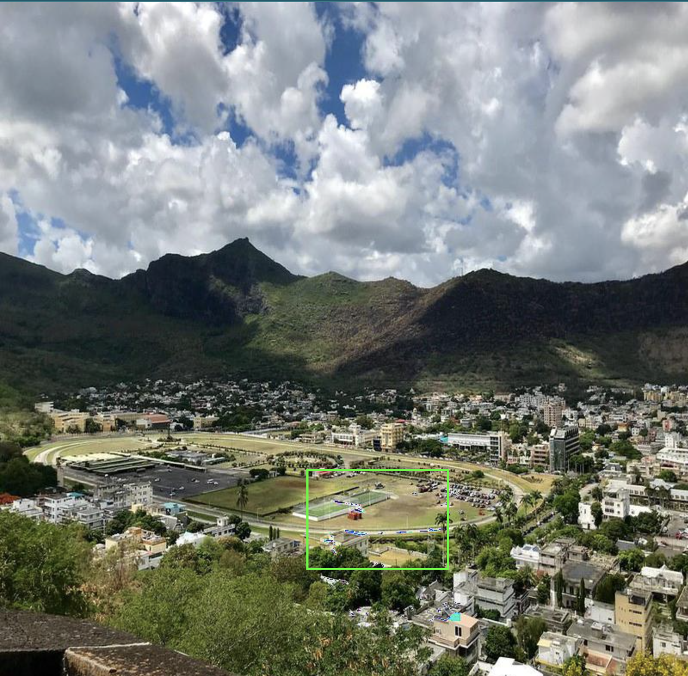

# MSDS_631_Group10

This notebook contains the slides and Jupyter notebook from Anthony Wang and Yuefan Wang's final project in MSDS 631. 

## Objectives

Our motivation behind this project was to approach object detection from a different perspective. Often times, object detection in deep learning is to train a model that can mimic a human being's object detection ability. The picture below is what a typical object detection model does.

For many object detection models, the model is considered good enough if it can do what a human does. What if we could train a model to detect nearly impercetible changes in color and shading? We were curious to test how "sharp" an object detction model's vision could get.

It's easy to see what's going on here. We've changed the color in the middle of the lake to bright green, and it's not exactly camouflage. Let's make the task harder.

You probably didn't notice where the anomaly is. If you did, it probably took you a while.

We took a random landscape photo and multiplied all the RGB values of the pixels inside this box by 1.2-- if you look carefully, you can see a few patches of neon. Let's find out if we train a model that can detect anomalies like this.

## Data Preparation

We write a [script](notebooks/image_scrambling.ipynb) that scraped around 300 photos and modified them all in subtle ways like in the photo above. To prepare this data, We created a folder with all the altered photos and a dataframe. Each row of the dataframe has a path to a specific photo as well as which part of the photo We altered and the ratio that increased the RGB values of the pixels by. This is one of the example:

The dataset we prepare looked like this:

## Data Preparation
